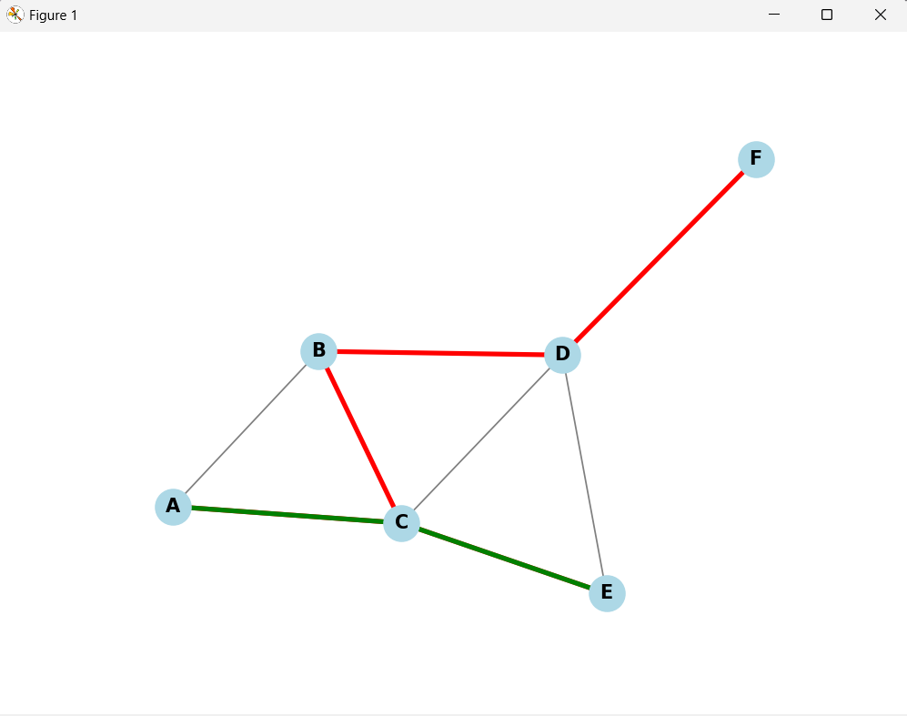

# Dijkstra Algorithm Visualizer

This project implements Dijkstra's algorithm to find the shortest path in a graph and visualizes it using Matplotlib and NetworkX in Python.

## Usage

To use this code, follow these steps:

1. **Install Required Libraries:**
   Run the following command in your terminal to install the necessary libraries.

   ```bash
   pip install matplotlib networkx
   ```

2. **Run The Code**
   Define your graph as a dictionary where keys represent nodes and values represent neighbors along with the edge weights.

   ```bash
   python your_script.py
   ```
   
## Function Explanation

- `dijkstra(graph, start)`: This function implements Dijkstra's algorithm to find the shortest path from the start node to all other nodes in the graph.

- `visualize_graph(graph, shortest_path, shortest_path_to_end)`: This function visualizes the graph and highlights the shortest path from the start node to all other nodes and the shortest path from the start node to the end node.

- `make_dict(s)`: This function converts a list of nodes representing a path into a dictionary where keys are nodes and values are their next nodes in the path.

## Example Output



## Additional Notes

- Ensure that your graph is represented correctly with appropriate node names and edge weights.
- You can modify the graph, start node, and end node according to your requirements.

Feel free to explore and modify the code according to your needs! If you have any questions or need further assistance, don't hesitate to ask.

## License

This project is licensed under the terms of the MIT license. See the [LICENSE](LICENSE) file for details.
